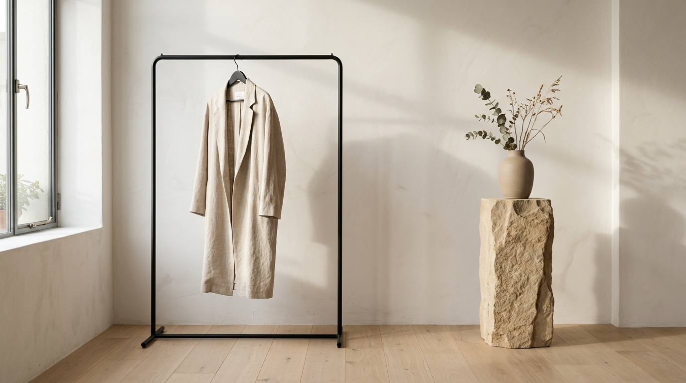
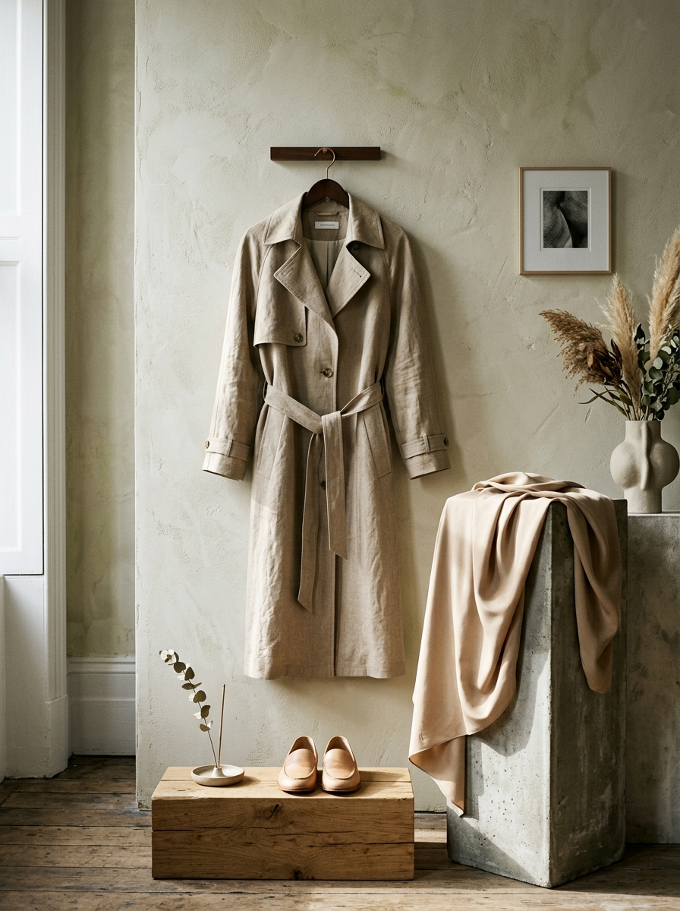

# LUMINA: Fine Essentials

> **Silent Luxury. Crafted Lines.** An antidote to the excess of fast consumption.

LUMINA is a high-end, visually polished e-commerce platform curated for quiet luxury, slow-fashion garments, and tactile artisanal home objects. Inspired by Scandinavian minimalism and warm stone architectural profiles, it acts as a digital lookbook and bespoke studio shopping experience.

---

## 🎨 Visual Identity & Brand Showcase

### Curated Zenith Lookbook
Modern structural silhouettes meet natural luxury fibers. The interface incorporates custom morning light gradients, rich tactile textures, and airy layouts.

<p align="center">
  
</p>

### The Capsules
Lumina specializes in three deliberate creative divisions representing clean, traceably sourced works:

1. **Summer Solstice Capsule** (Apparel) — Lightweight heavy-wash Belgian linens and stone-tinted silks.
2. **Leather Craft** (Accessories) — Bridal leathers structured with sand-polished stainless components.
3. **Clay & Fire Studio** (Fine Home) — Hand-fired clay vessels and textured stoneware crafted by multi-generational workshops.

<p align="center">
  
  
</p>

---

## 💎 Core Features

- 🎪 **Atelier Hero Carousel**: Dynamic autoplaying lookbook slider framing distinct slow-fashion capsules with responsive touch, manual slide switches, and progress indicators.
- 🌾 **Bento-Grid Divisions**: Visual category bento cards with responsive zoom-and-fade hovering.
- 🔍 **Frictionless Catalog Native Filters**: Instant client-side search indexing coupled with sorting overrides (Featured, Price ascension/descension, or Curator-preferred ratings).
- 🏷️ **Interactive Sizing & Tone Customization**: High-fidelity options panel with contextual color swatches matching materials like Charcoal, Camel, Sage, and Slate.
- 🎒 **Atelier Shopping Bag & Secure Drawer**: 
  - Dynamic free carbon-neutral shipping indicator sliding progressively toward a $250 threshold.
  - Multi-item quantities synchronizer with immediate subtotal, local tax, and estimated delivery breakdown.
- 🛡️ **Secure Checkout Walkthrough**: Seamlessly guides the user through shipping coordinates and seals the order with a cryptographic atelier receipt.
- ❤️ **Saved Favorites (Wishlist)**: Persistent bookmarking of design concepts directly synced to browser local storage.
- 🔔 **Hologram Toast Notifications**: Clean sliding and spinning toast popups notifying the client of bag adjustments.

---

## 🏗️ Technical Architecture & Stack

LUMINA is built using highly performant React combined with industry-standard utility styles:

- **Frontend Core**: React (Functional Hooks with localized and synchronized states).
- **Styling**: Tailwind CSS (Earthy-warm stone tones, custom font systems, elegant display serifs).
- **Motion Engine**: Framer Motion (`motion/react`) for fluid AnimatePresence transitions, slide-ins, and layout-preserving zooms.
- **Iconography**: Lucide React (Thin line vectors prioritizing negative space and geometric precision).
- **Environment**: Vite + TypeScript (supporting instant hot module compilation and fast deployment).

---

## 📂 Code Directory Map

```text
/
├── src/
│   ├── App.jsx                 # Zenith state hub (synced cart, favorites, alert signals)
│   ├── main.jsx                # StrictMode app entryway
│   ├── data.js                 # Unified static catalog database and customer words
│   ├── index.css               # Global CSS entry with tailored font pairings and Tailwind rules
│   └── components/
│       ├── Navbar.jsx          # Elastic search field, collections navigator, and status counts
│       ├── Hero.jsx            # Autoplay hero showcase with tactile description logs
│       ├── Categories.jsx      # Curated divisions cards (Bento layout)
│       ├── ProductGrid.jsx     # Live product feed, heart toggles, and sorting selectors
│       ├── ProductDetailModal.jsx # Detail overview with color selection, and sizing options
│       ├── CartDrawer.jsx      # Dispatch panel, shipping progress, and checkout wizard
│       ├── Testimonials.jsx    # Word of the visual directors, trust factors, and returns loop
│       └── Footer.jsx          # Newsletter dispatch subscription and coordinated references
```

---

## 🌿 Our Ethical Promise

- **100% Traceability**: Every piece embeds a secure coordinate stamp trace back to organic raw flax fields or leather workshops.
- **Slow Loop Exchange**: Complimentary modifications and size tailoring to maximize product lifetime.
2. **Circular Recycled Coupons**: Return worn Lumina garments to receive a 20% recycled coupon while our artisans repair and donate or upcycle the materials.

  
  
  
  


